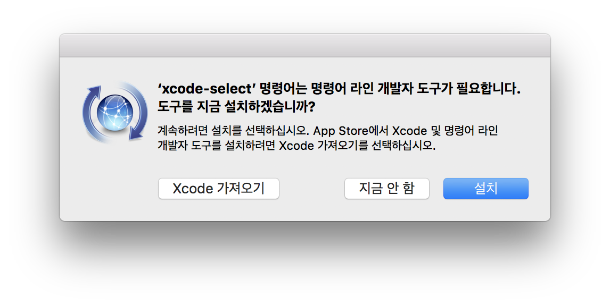

# 64비트 멀티코어 OS 원리와 구조

"64비트 멀티코어 OS 원리와 구조"라는 책을 공부하면서 간단히 정리한 내용입니다.

**차례**

* [64비트 멀티코어 OS 원리와 구조](#64비트-멀티코어-OS-원리와-구조)
    * [macOS에서 개발환경 구축하기](#macOS에서-개발환경-구축하기)
        * [명령어 라인 개발자 도구 설치](#명령어-라인-개발자-도구-설치)
            * [OS X 10.9 Mavericks 이후](#OS-X-109-Mavericks-이후)
            * [OS X 10.8 Mountain Lion](#OS-X-108-Mountain-Lion)
        * [Cross-compiler 빌드](#Cross-compiler-빌드)
            * [공통 사항](#공통-사항)
            * [GNU Binutils 빌드](#GNU-Binutils-빌드)
            * [GCC 빌드](#GCC-빌드)
        * [MacPorts를 이용한 NASM, QEMU설치](#MacPorts를-이용한-NASM-QEMU설치)
            * [QEMU 관련 참고사항](#QEMU-관련-참고사항)
    * [추가 링크](#추가-링크)

## macOS에서 개발환경 구축하기

### 명령어 라인 개발자 도구 설치

크로스 컴파일러를 빌드하기 위해선 네이티브 컴파일러(Native Compiler)가 필요합니다. OS X 10.7 Lion까지는 기본적으로 컴파일러와 어셈블러가 설치되어 있기 때문에 건너띄어도 관계없지만, OS X 10.8 Mountain Lion부터는 추가 설치가 필요합니다.

#### OS X 10.9 Mavericks 이후

OS X 10.9 Mavericks에서는 [XCode](https://itunes.apple.com/app/xcode/id497799835)와 명령어 라인 개발자 도구가 별도로 배포되고 있습니다. 터미널을 열고 다음 명령을 실행하여 명령어 라인 개발자 도구를 설치할 수 있습니다.

    $ xcode-select --install

명령을 실행하면 다음과 같은 팝업창이 뜹니다.

"설치"버튼을 클릭해 명령어 라인 개발자 도구를 설치합니다.

#### OS X 10.8 Mountain Lion

[XCode](https://itunes.apple.com/app/xcode/id497799835)를 실행한 후, XCode 메뉴 → Preferences... → Downloads 탭으로 이동합니다. Components 탭의 "Command Line Tools"를 설치합니다.

### Cross-compiler 빌드
macOS 개발툴에 포함된 유틸리티들은 GNU의 툴과 호환되지 않습니다. 특히, 7장 링커스크립트 부분 부터는 원할한 진행이 어렵습니다. 다음 과정은 모두 터미널(/Applications/Utilities/Terminal.app)상에서 진행됩니다.

#### 공통 사항
빌드 타겟과 설치 디렉토리를 환경변수로 선언합니다. PREFIX 환경변수를 "/opt/cross" 디렉토리로 설정하였으나 임의의 다른 디렉토리를 사용해도 무방합니다.

    $ export TARGET=x86_64-pc-linux
    $ export PREFIX=/opt/cross

홈 디렉토리의 ".bash_profile"파일(또는 ".bashrc"파일)을 편집해 크로스 컴파일러의 실행 디렉토리를 PATH 환경 변수에 추가합니다. 만약 없다면 마지막 라인에 새로 추가해 줍니다. 실행 디렉토리는 하위 디렉토리 "bin"에 위치합니다.

    $ export PATH=/opt/cross/bin:$PATH

#### GNU Binutils 빌드
[GNU Binutils](http://www.gnu.org/software/binutils/)는 macOS의 Mach-O 형식을 지원하지 않기 때문에 MacPorts를 이용해 설치할 경우에  as, ld등의 명령이 설치되지 않습니다. 따라서 직접 컴파일해야 합니다. 필자는 "binutils-2.23.tar.gz" 파일을 "다운로드" 폴더에 받았습니다. 터미널을 열고 다운로드 받은 디렉토리로 이동해 압축을 해제합니다.

    $ cd ~/Downloads
    $ tar xvf binutils-2.23.tar.gz
    $ cd binutils-2.23

소스코드를 빌드합니다. 아래 내용은 책과 동일합니다. 자세한 설명을 책을 참고하시기 바랍니다. (57쪽, 2.2.1 GNU Binutils 생성하기) 단, "make install" 명령 대신 "sudo make install" 명령을 사용함을 주의하기 바랍니다.

    $ ./configure --target=$TARGET --prefix=$PREFIX --enable-64-bit-bfd --disable-shared --disable-nls
    $ make configure-host
    $ make LDFLAGS="-all-static"
    $ sudo make install

#### GCC 빌드
macOS는 Mach-O 형식의 실행 파일을 사용합니다. 때문에 macOS 개발툴에 포함된 GCC는 Mach-O 형식의 실행파일을 생성하며, 책에서 사용하는 ELF 형식을 지원하지 않습니다. 소스코드는 [GCC, the GNU Compiler Collection](http://gcc.gnu.org)에서 다운로드 받을 수 있습니다. GNU Binutils와 같은 요령으로 압축을 해제하고 해당 디렉토리로 이동합니다.

    $ cd ~/Downloads
    $ tar xvf gcc-4.7.2.tar.gz
    $ cd gcc-4.7.2

GCC는 컴파일할 때, GMP, MPC, MPFR등의 라이브러리를 요구합니다. 압축해제한 소스 패키지에 필요한 라이브러리를 다운로드 받아 추가하는 스크립트가 포함되어 있습니다.

    $ ./contrib/download_prerequisites

소스코드를 빌드합니다. 책에서 나온 몇 단계는 macOS 환경에선 불필요하기 때문에 생략 되었습니다. 단, "make install-gcc" 명령 대신 "sudo make install-gcc" 명령을 사용함을 주의하기 바랍니다.

    $ ./configure --target=$TARGET --prefix=$PREFIX --disable-nls --enable-languages=c --without-headers --disable-shared --enable-multilib
    $ make configure-host
    $ make all-gcc
    $ sudo make install-gcc

### MacPorts를 이용한 NASM, QEMU설치
macOS 개발툴에 포함된 NASM은 ELF64 형식을 지원하지 않아, 10장부터 원할한 진행이 어렵습니다. 별도로 컴파일 할 수도 있지만, 유지/관리가 편리한 [The MacPorts Project](http://www.macports.org/)를 사용합니다. 간편한 Package Installer를 사용하거나 소스코드를 다운로드 받아 설치합니다. MacPorts를 설치했다면, 다음 명령으로 QEMU를 설치합니다.

    $ sudo port install nasm qemu

#### QEMU 관련 참고사항
* QEMU v0.10.4의 사용을 권장하고 있으나 macOS에서 v0.10.4는 정상적으로 설치되지 않습니다.
* 2013년 4월 기준 최신버전인 v1.4.0에서는 하드디스크 드라이버가 정상 작동하지 않습니다.
* QEMU 실행시 "Can't open BIOS image bios.bin" 오류가 발생한다면 "-L ." 옵션을 제거하고 실행하시기 바랍니다.

## 추가 링크
* 저자의 웹사이트 - <http://www.mint64os.pe.kr/>
* OSDev Wiki - <http://wiki.osdev.org/>
* GCC - <http://gcc.gnu.org/>
* GNU Binutils - <http://www.gnu.org/software/binutils/>
* NASM - <http://www.nasm.us/>
* The MacPorts Project - <http://www.macports.org/>

